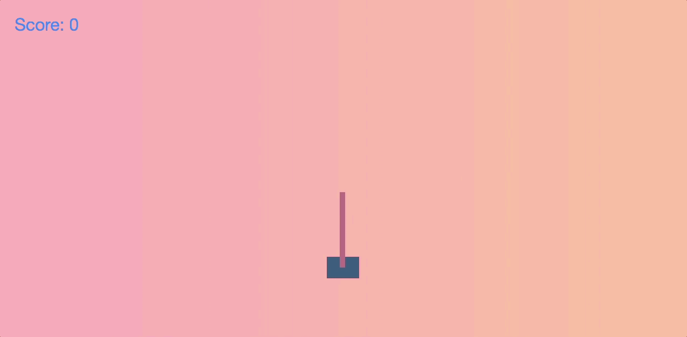

# PoleBalancingAct

https://polebalancingact--niks2000.repl.co/

Reinforcement learning (RL) is the field of study delving in teaching agents (our algorithm/machine) to perform certain tasks/actions without explicitly telling it how to do so.

We have created an agent that can solve the problem of balancing a pole on a cart, by pushing the cart left or right.

Some jargons realted to RL:-

1) State:- A state is what the game looks like at the moment. In the case of cart pole, our state is composed of 4 numbers: the position of the cart, the speed of the cart, the position of the pole (as an angle) and the angular velocity of the pole.

2) Policy:- A policy is a function that can take the state of the game (ex. position of board pieces, or where the cart and pole are) and output the action the agent should take in the position (ex. move the knight, or push the cart to the left). A policy is the decision making ability of the agent.

Packages Used:-

1) Numpy

2) Open AI Gym

3) Flask
